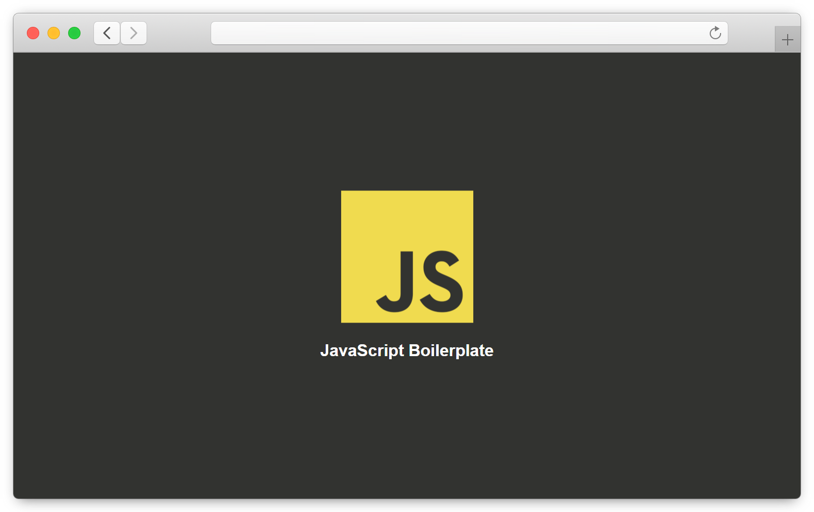

<!-- APPLICATION PREVIEW -->
<div align="center">
  
  
  
</div>

<!-- SHIELDS -->
<div align="center">
  
  
  
  [](https://github.com/lszymanski7/boilerplate-js/blob/main/LICENSE.md)
  
  
  
  
</div>

<br/>

<!-- JAVASCRIPT BOILERPLATE -->
# JavaScript Boilerplate
Boilerplate for creating projects in the JavaScript programming language. It includes the basic configuration of tools such as Webpack, Babel, Jest, Express, ESLint and Prettier. Designed to speed up the process of building new projects. Don't waste your time configuring the tools commonly used in web development.

<!-- TABLE OF CONTENTS -->
## Table of Contents
1. [Features](#features)
2. [Technologies](#technologies)
3. [Development](#development)
    - [Prerequisites](#prerequisites)
    - [Installation](#installation)
    - [Compilation](#compilation)
    - [Webpack Dev Server](#webpack-dev-server)
    - [ESLint](#eslint)
    - [Prettier](#prettier)
4. [Testing](#testing)
5. [Production](#production)
6. [Heroku](#heroku)
    - [Prerequisites](#prerequisites-1)
    - [Deployment](#deployment)
7. [Contributing](#contributing)
8. [Acknowledgements](#acknowledgements)
9. [License](#license)
  
<!-- FEATURES -->
## Features
- Webpack configuration split into three files to separate development and production environments. Provides support for Webpack Dev Server and plugins such as: 
  - html-webpack-plugin,
  - copy-webpack-plugin,
  - mini-css-extract-plugin,
  - css-minimizer-webpack-plugin,
  - terser-webpack-plugin.
- Converting ECMAScript 2015+ code into a backwards compatible version of JavaScript. 
- Possibility to conduct unit tests and generate code coverage.
- A simple Express server that allows you to deploy your application to Heroku.
- Checking JavaScript code to find existing problems.
- Formatting all supported files.

<!-- TECHNOLOGIES -->
## Technologies


[](https://sass-lang.com)
[](https://webpack.js.org)
[](https://babeljs.io)
[](https://jestjs.io)
[](https://nodejs.org/en)
[](https://npmjs.com)
[](https://expressjs.com)
[](https://eslint.org)
[](https://prettier.io)

All technologies and tools were used in the latest version at the time of creating the project.

<!-- DEVELOPMENT -->
## Development

<!-- PREREQUISITES -->
### Prerequisites
> You can download Node.js installer [here](https://nodejs.org/en/download).

This project was created with the Node.js (v18.6.0) runtime environment and the NPM (v8.15.0) for package management. Use the Node.js installer to install both of them on your system.
  
<!-- INSTALLATION -->
### Installation
Follow all of the steps below to get a local copy of the project and install any dependencies required to run it.

1. Clone the repository.

```
$ git clone https://github.com/lszymanski7/boilerplate-js.git
```

2. Navigate to the project directory.

```
$ cd boilerplate-js
```

3. Install all dependencies.

```
$ npm install
```

<!-- COMPILATION -->
### Compilation

<!-- WEBPACK DEV SERVER -->
### Webpack Dev Server

<!-- ESLINT -->
### ESLint
ESLint is a tool designed to find and fix problems in ECMAScript/JavaScript code. Thanks to its use, the code is more consistent and free from common bugs. It's also fully customizable. You can disable any rule that doesn't meet your project's requirements.

Run the command below to check JavaScript code and find any existing problems.

```
$ npm run eslint:check
```

Another command allows you to find issues and fix them. Keep in mind that not all problems are fixable using this option. You can also ignore specific files and directories from this process in the [.eslintignore](https://github.com/lszymanski7/boilerplate-js/blob/main/.eslintignore) file.

> **Warning** This overwrites your files!

```
$ npm run eslint:fix
```

<!-- PRETTIER -->
### Prettier

<!-- TESTING -->
## Testing

<!-- PRODUCTION -->
## Production

<!-- HEROKU -->
## Heroku

<!-- PREREQUISITES -->
### Prerequisites

<!-- DEPLOYMENT -->
### Deployment

<!-- CONTRIBUTING -->
## Contributing

<!-- ACKNOWLEDGEMENTS -->
## Acknowledgements

<!-- LICENSE -->
## License
> You can check out the full license [here](https://github.com/lszymanski7/boilerplate-js/blob/main/LICENSE.md).
  
This project is licensed under the terms of the **MIT** license.
  
<br/>
 
<!-- LINKS -->
##
<div align="center">
  <p>Connect with me:</p>
  
  [](https://stackoverflow.com/users/18706083)
  [](https://gitlab.com/lszymanski7)
  [](https://linkedin.com/in/lszymanski7)
  [](https://twitter.com/lszymanski7_)
  
</div>
